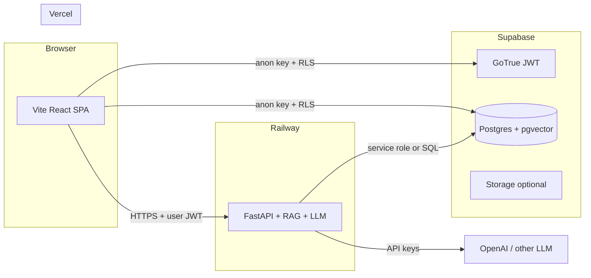

# AI backend architecture (FastAPI on Railway)

This document defines how the **Researcha** stack evolves so the SPA stays on **Vercel** while **AI inference and RAG** run on a **FastAPI** service on **Railway**—optimized for latency, secrets isolation, and a clear path to grow.

---

## Do you need a separate Git repo?

**No.** For a solo (or small) team shipping one product, a **monorepo** is recommended:

| Approach | When to use |
|----------|-------------|
| **Same repo, `backend/` folder** (this layout) | One product, shared releases, simplest mental model. **Vercel** = root / existing app folder; **Railway** = service root `backend/`. |
| **Separate repo** | Large org split by team, different access controls, or independent release cadence for the API only. |

You do **not** have to move the React app under `frontend/` unless you want stricter symmetry. Keeping `src/`, `package.json`, and Vite at the **repository root** is valid: the monorepo is “frontend at root + `backend/` sibling.”

---

## High-level system diagram



**Principles**

1. **Browser never holds** LLM API keys or `service_role` keys—only `VITE_SUPABASE_*` anon + URL as today.
2. **Railway holds** model provider keys, optional `SUPABASE_SERVICE_ROLE_KEY` for server-side vector search / jobs that must bypass RLS, and any future queue credentials.
3. **User identity** for paywalled answers: the SPA sends the **Supabase access JWT** (or a short-lived session token) to FastAPI; FastAPI **verifies** it (JWKS from Supabase) and loads `profiles.app_role`, entitlements, etc., before running RAG.

---

## Repository layout (target)

```text
researcha-app/                 # Git root (monorepo)
├── src/                       # React app (unchanged location)
├── public/
├── package.json
├── vite.config.js
├── vercel.json                # SPA rewrites; Vercel project root = this folder
├── docs/
│   ├── architecture-ai-backend.md   # this file
│   ├── fastapi-rag-railway-plan.md  # RAG performance & streaming patterns
│   └── pdf-ingest-rag-pipeline.md   # PDF shrink → text → chunks → pgvector
└── backend/                   # Railway service root (set in Railway dashboard)
    ├── Procfile
    ├── requirements.txt
    ├── README.md
    ├── .env.example
    └── app/
        ├── __init__.py
        ├── main.py            # FastAPI app, CORS, router includes
        ├── api/               # route modules (ingest, chat, …)
        │   ├── __init__.py
        │   └── ingest.py
        ├── core/              # settings, logging, security
        │   ├── __init__.py
        │   └── config.py
        └── services/          # pdf_pipeline, chunking, rag, embeddings
            ├── __init__.py
            ├── chunking.py
            └── pdf_pipeline.py
```

Optional later: `backend/tests/`, `backend/pyproject.toml` if you migrate from `requirements.txt`.

---

## Deploy mapping

| Platform | Root directory | Build / start |
|----------|------------------|---------------|
| **Vercel** | Repo root (current) | `npm run build` → `dist/` |
| **Railway** | `backend/` | Install `requirements.txt`; start via `Procfile` (`uvicorn`) |

Each service only watches its tree; no need to split repos for that.

---

## API contract (evolution)

**Today:** stub `GET /health`.

**Next (recommended shapes):**

- `POST /v1/chat` or `POST /v1/chat/stream` — body: `{ "messages": [...], "conversation_id": "optional" }`, header: `Authorization: Bearer <supabase_access_token>`.
- **Streaming:** Server-Sent Events (SSE) or chunked JSON lines so the SPA can render tokens as they arrive (**feels fast** without waiting for full completion).
- **RAG:** FastAPI loads embedding query → vector search on `report_chunks` (or RPC you define in Supabase) → inject top-k chunks into the system prompt → call LLM.

**Auth verification options (pick one and stick to it):**

1. **JWT validation in FastAPI** using Supabase JWKS URL (no DB round-trip for auth only).
2. **`supabase.auth.get_user(jwt)`** with the service client on the server after verifying signature.

Always enforce **entitlements** (which reports the user may cite) using the same rules as your migration RLS intent—either duplicate checks in SQL from the service role or call a `security definer` RPC that takes `auth.uid()` equivalent from the verified JWT.

---

## Environment variables

### Vercel (frontend)

| Variable | Purpose |
|----------|---------|
| `VITE_SUPABASE_URL` | Existing |
| `VITE_SUPABASE_ANON_KEY` | Existing |
| `VITE_AI_API_URL` | Base URL of Railway FastAPI, e.g. `https://your-service.up.railway.app` (no trailing slash) |

### Railway (backend)

| Variable | Purpose |
|----------|---------|
| `SUPABASE_URL` | Project URL |
| `SUPABASE_JWT_SECRET` or JWKS usage | Verify user JWTs from the SPA |
| `SUPABASE_SERVICE_ROLE_KEY` | **Server only** — vector search, admin-style reads if required by RAG |
| `OPENAI_API_KEY` (or other) | LLM + embeddings |
| `ALLOWED_ORIGINS` | Comma-separated list of Vercel preview + production origins for CORS |

Never commit these; use Railway **Variables** and local `.env` (gitignored).

---

## CORS and security

- Restrict `ALLOWED_ORIGINS` to your real Vercel domains (and `http://localhost:5173` for dev).
- **Rate limiting** on `/v1/chat` (per user id from JWT) to avoid abuse—add when public.
- **Request size limits** for message payloads.
- Log **request id** + user id; never log full prompts if policy forbids.

---

## Why FastAPI on Railway (vs only Supabase Edge Functions)

- **Long-lived** streaming connections and Python **ecosystem** for RAG (LangChain/LlamaIndex optional later) without Edge runtime limits.
- **CPU/RAM** sizing on Railway for embedding batch jobs later.
- Supabase remains **source of truth** for data, vectors, and auth; FastAPI is the **orchestration** layer for “fast AI responses.”

You can still add Edge Functions later for webhooks (payments) without replacing this AI service.

---

## `.gitignore` (monorepo hygiene)

At repo root, ignore Python artifacts under `backend/`:

- `backend/.venv/`, `backend/venv/`, `__pycache__/`, `*.pyc`, `.env` in `backend/` if used locally.

Keep ignoring `node_modules/`, `dist/`, and root `.env` as today.

---

## Related documentation

| Document | Topic |
|----------|--------|
| [`pdf-ingest-rag-pipeline.md`](./pdf-ingest-rag-pipeline.md) | PDF shrink, text extract, chunk → `report_chunks` + Storage strategy. |
| [`fastapi-rag-railway-plan.md`](./fastapi-rag-railway-plan.md) | Streaming RAG, embedding caches, HNSW, chunk sizing, model choices. |

---

## Summary

| Question | Answer |
|----------|--------|
| Separate repo required? | **No** — use `backend/` in this repo. |
| Move React to `frontend/`? | **Optional** — not required for Vercel + Railway. |
| Where do LLM secrets live? | **Railway only.** |
| How does the SPA call AI? | `VITE_AI_API_URL` + `fetch`/`EventSource` with **Supabase JWT** for user-scoped RAG. |

Next implementation steps (when you are ready): implement PDF → `report_chunks` per [`pdf-ingest-rag-pipeline.md`](./pdf-ingest-rag-pipeline.md), RAG/chat per [`fastapi-rag-railway-plan.md`](./fastapi-rag-railway-plan.md), JWT middleware, and replace mock UI on `AIAgentPage` with streaming client code.
